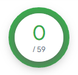

[](https://pycqa.github.io/isort/)

# Kilogger
This is an educational purpose keylogger.

**What it can do?**
- [x] Capture and log pressed keys.
- [x] Watch processes to trigger keylogger.
- [ ] Log clipboard.
- [ ] Acquire logs from remote.

## Installation
1. Clone the repository:
```
git clone https://github.com/antoninoLorenzo/kilogger.git
```

2. Install dependencies:
```
cd kilogger && pip install -r requirements.txt
```

**Dependencies**
- pynput
- psutil

## Usage
**Run**
```
python kilogger.py [ARGS]
```

**Help**
```
usage: cli.py [-h] [--output OUTPUT] [--force {0,1}] [--targets TARGETS]

options:
  -h, --help         show this help message and exit
  --output OUTPUT    Path for the output log file (ex. ./output.log); defaults to ~/.cache/report.log
  --force {0,1}      0: do not force logger if AV is on. 1: fuck it
  --targets TARGETS  Name of target processes (ex. "chrome.exe, firefox.exe"); note: process names should be separated by ", ".
```

*PS: if the antivirus is on use:* `--force 1`

## AV Detection
On [VirusTotal](https://www.virustotal.com/gui/home/upload) the score for `cli.py` file is the following:



For the compiled version I will add a `COMPILE.md`, right now it doesn't get detected by Windows Defender, but has a score of 7/60 on VirusTotal.

## Disclaimer
**kilogger** is for educational purposes only. It's not intended for malicious use or unauthorized access. 

By using this project, <u>you agree to use it responsibly and ethically</u>.
- We are not responsible for any misuse of this tool, users are responsible for their actions. 
- This project is provided "as is" without warranties. 
- Use with explicit consent and respect for privacy.
